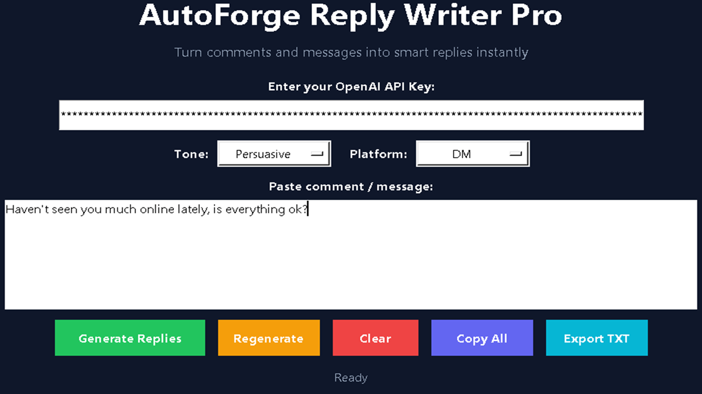
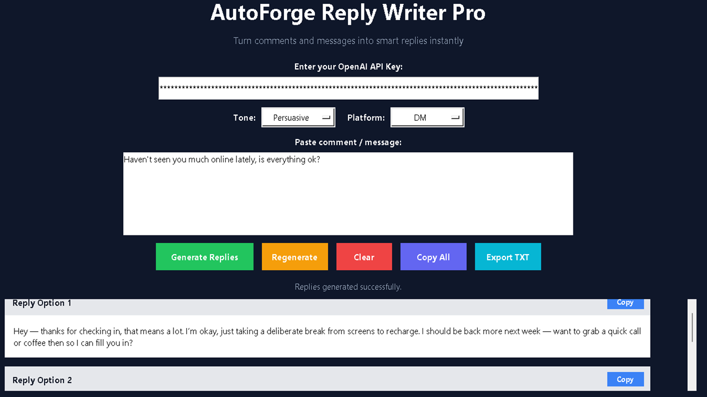
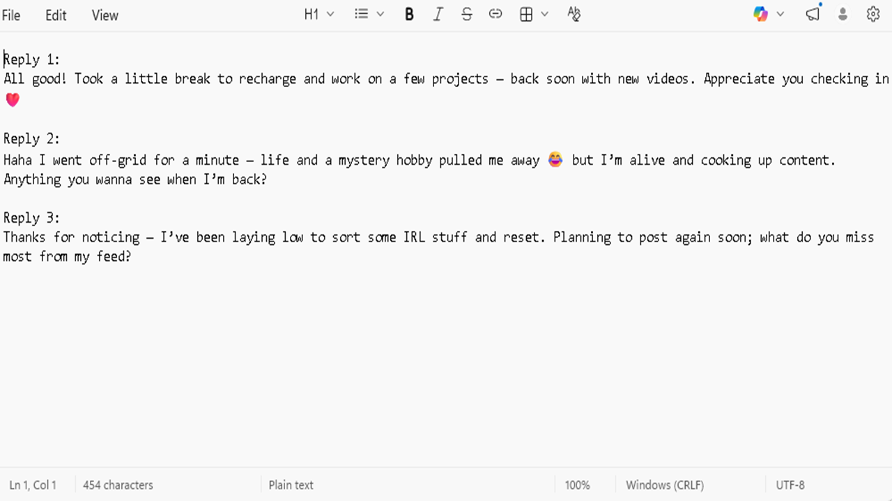

# AutoForge Reply Writer Pro

AutoForge Reply Writer Pro is a lightweight Windows application that generates clean, professional replies for emails, messages, and client communication in seconds.

---

## 🚀 Features

- Generate multiple reply options instantly
- Clean, ready-to-use responses
- Copy replies with one click
- Export replies to TXT
- Simple, distraction-free interface

---

## 🧠 How It Works

1. Enter your message or situation  
2. Click **Generate Replies**  
3. Copy or export the response instantly  

---

## 📸 Screenshots

### Main Interface

### Generate Replies

### Output Result

---

## 🎯 Use Cases

- Client communication  
- Email replies  
- Social media responses  
- Customer support messages  

---

## ⚙️ Requirements

- Windows OS  
- Internet connection  
- API key (user-provided)  

---

## 📦 Installation

Download the latest version from Gumroad and run the installer.

---

## 💡 Why I Built This

I was tired of rewriting the same types of messages over and over.  
This tool removes that friction and helps you respond faster with clarity.

---

## 🛠️ Support

Contact:autoforge.atd@gmail.com
Response:24-48 hours

---

## 📄 License

Personal Use Licennse- This product may not be resold,redistibuted or used for commercial resale.

---

## 📬 Feedback

Open to suggestions and improvements — feel free to reach out or create an issue.
